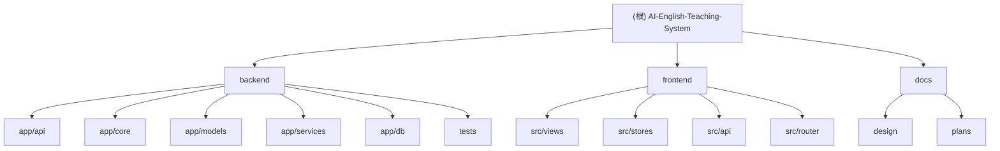

# AI 赋能英语教学系统

> **最后更新**: 2026-02-03 18:30:00
> **文档版本**: v1.0
> **项目状态**: 开发中 (MVP阶段)

---

## 变更记录

### 2026-02-03 19:00:00
- 🎨 **前端**: 错题本 PDF 导出功能完善
  - 修复 MistakeBookView.vue 导入问题（ElLoading、重复图标）
  - 前端 API 完整支持 PDF/Markdown/Word 导出
  - 实现批量导出和单个错题导出 UI

### 2026-02-03 18:30:00
- ✨ **新增**: PDF 渲染服务 (`pdf_renderer_service.py`)
  - 集成 markdown2 + weasyprint 实现 Markdown 到 PDF 转换
  - 支持中文内容的跨平台字体检测
  - 完整的 CSS Paged Media 样式支持（分页、页眉页脚、表格）
- ✨ **新增**: 错题本 PDF 导出功能
  - 支持单个错题和批量错题导出
  - 从 Jinja2 模板生成结构化错题报告
- ✅ **新增**: PDF 辅助工具 (`pdf_helpers.py`)
  - 跨平台字体检测（macOS/Windows/Linux）
  - CSS 字体族生成
- 📊 **测试**: PDF 渲染服务测试覆盖率 88%
- 🔧 **依赖**: 添加 markdown2、weasyprint 61.2、pydyf 0.8.0

### 2026-02-03 09:49:22
- 初始化 AI 上下文文档体系
- 完成项目架构扫描与模块识别
- 生成根级文档与模块级文档结构

---

## 项目愿景

AI 赋能英语教学系统是一个基于"素养打底，考点融入"理念的个性化英语学习平台，通过 AI 技术实现：

- **智能分级推送**: 基于i+1理论，动态推送难度适配的学习内容
- **知识图谱诊断**: 构建学生个性化知识画像，精准定位薄弱环节
- **AI口语陪练**: 零压力的AI对话环境，提升口语表达能力
- **AI辅助备课**: 自动生成教案、课件、练习，提高教师备课效率

### 核心价值

- **成本优化**: 混合架构（本地向量搜索+云端AI），降低95%的AI调用成本
- **个性化学习**: 每个学生都有独特的知识图谱和学习路径
- **教师提效**: AI助教从重复性劳动中解放教师
- **数据驱动**: 用数据说话，化解家长焦虑

---

## 架构总览

```
┌─────────────────────────────────────────────────────────────────┐
│                        前端层 (Vue3)                           │
├─────────────────────────────────────────────────────────────────┤
│  教师端 (登录/班级管理/备课助手)    学生端 (课程/练习/对话)  │
└─────────────────────────────────────────────────────────────────┘
                              │
                              │ REST API
                              ▼
┌─────────────────────────────────────────────────────────────────┐
│                     应用层 (FastAPI)                            │
├─────────────────────────────────────────────────────────────────┤
│  用户服务  │  内容服务  │  学习服务  │  AI服务  │  认证服务  │
└─────────────────────────────────────────────────────────────────┘
                              │
                              ▼
┌─────────────────────────────────────────────────────────────────┐
│                        数据层                                   │
├─────────────────────────────────────────────────────────────────┤
│  PostgreSQL  │  Redis  │  Qdrant向量库  │  S3/OSS存储          │
└─────────────────────────────────────────────────────────────────┘
                              │
                              ▼
┌─────────────────────────────────────────────────────────────────┐
│                        AI服务层                                 │
├─────────────────────────────────────────────────────────────────┤
│  OpenAI GPT-4  │  Anthropic Claude  │  语音服务(TTS/STT)      │
└─────────────────────────────────────────────────────────────────┘
```

### 技术栈

| 层级 | 技术选型 | 说明 |
|------|----------|------|
| 前端 | Vue3 + Vite + Pinia + Element Plus | 组合式API，状态管理 |
| 后端 | FastAPI + SQLAlchemy + Alembic | 异步支持，ORM管理 |
| 数据库 | PostgreSQL 15 + Redis 7 | 主数据库+缓存 |
| 向量库 | Qdrant | 向量相似度搜索 |
| PDF导出 | markdown2 + weasyprint | Markdown转PDF渲染 |
| AI服务 | OpenAI GPT-4 / Anthropic Claude | 大语言模型 |
| 部署 | Docker + Docker Compose | 容器化部署 |

---

## 模块结构图



---

## 模块索引

| 模块 | 路径 | 职责 | 主要语言 | 文档状态 |
|------|------|------|----------|----------|
| **后端** | `backend/` | FastAPI后端服务，提供API、业务逻辑、数据持久化 | Python | 已完成 |
| **前端** | `frontend/` | Vue3前端应用，教师端与学生端 | TypeScript/Vue | 已完成 |
| **文档** | `docs/` | 设计文档与实施计划 | Markdown | 已完成 |

---

## 运行与开发

### 前置要求

- Python 3.11+
- Node.js 18+
- Docker & Docker Compose
- Git

### 快速启动

#### 1. 启动基础设施

```bash
# 在项目根目录
cd backend
docker-compose up -d
```

这将启动 PostgreSQL、Redis 和 Qdrant 向量数据库。

#### 2. 后端设置

```bash
cd backend

# 创建虚拟环境
python -m venv venv
source venv/bin/activate  # Windows: venv\Scripts\activate

# 安装依赖
pip install -e ".[dev]"

# 配置环境变量
cp .env.example .env
# 编辑 .env 文件，配置必要参数

# 运行数据库迁移
alembic upgrade head

# 启动开发服务器
uvicorn app.main:app --reload --host 0.0.0.0 --port 8000
```

API 文档: http://localhost:8000/docs

#### 3. 前端设置

```bash
cd frontend

# 安装依赖
npm install

# 启动开发服务器
npm run dev
```

前端地址: http://localhost:5173

---

## 测试策略

### 后端测试

```bash
cd backend

# 运行所有测试
pytest

# 运行测试并生成覆盖率报告
pytest --cov=app --cov-report=html

# 运行特定测试文件
pytest tests/services/test_knowledge_graph_service.py
```

### 前端测试

前端测试框架待配置（计划使用 Vitest + Vue Test Utils）。

---

## 编码规范

### Python (后端)

- 遵循 PEP 8 规范
- 使用 Black 格式化代码 (行长度 100)
- 使用 Ruff 进行代码检查
- 类型检查使用 MyPy
- 文档字符串使用 Google 风格

```bash
# 格式化代码
black app tests

# 代码检查
ruff check app tests

# 类型检查
mypy app
```

### TypeScript (前端)

- 使用 ESLint + Prettier
- 遵循 Vue 3 组合式API最佳实践
- 使用 Pinia 进行状态管理

---

## AI 使用指南

### 项目架构理解

本项目采用混合AI架构，关键优化点：

1. **向量搜索优先**: 90%的内容匹配使用本地Qdrant向量搜索
2. **规则引擎**: 知识图谱日常更新使用规则引擎（零成本）
3. **AI精排**: 仅对Top 10结果使用AI进行精排和理由生成

### 关键服务文件

- `app/services/knowledge_graph_service.py`: 知识图谱诊断与更新
- `app/services/vector_service.py`: 向量搜索服务
- `app/services/graph_rules.py`: 规则引擎（零成本更新）
- `app/services/pdf_renderer_service.py`: PDF 渲染服务（markdown2 + weasyprint）
- `app/services/mistake_export_service.py`: 错题本导出（Markdown/PDF/Word）
- `app/core/security.py`: 认证与安全

### 成本优化提示

当修改AI相关代码时，请注意：
- 初始诊断和定期复盘使用AI（约占5%）
- 日常更新使用规则引擎（约占95%）
- 向量搜索在本地完成，无API调用成本

---

## 开发路线图

### MVP阶段 (3个月)

| 阶段 | 内容 | 状态 |
|------|------|------|
| 第1月 | 基础架构 + 用户系统 | 进行中 |
| 第2月 | 知识图谱 + 内容推荐 | 待开始 |
| 第3月 | 口语陪练 + AI备课 | 待开始 |

详见: [MVP实施计划](docs/plans/2026-02-01-mvp-implementation-plan.md)

---

## 常见问题

### Docker服务启动失败

检查端口是否被占用：
```bash
lsof -i :5432  # PostgreSQL
lsof -i :6379  # Redis
lsof -i :6333  # Qdrant
```

### 数据库连接失败

确认 Docker 服务正在运行：
```bash
cd backend
docker-compose ps
```

### AI API 调用失败

确认 API 密钥已正确配置：
```bash
echo $OPENAI_API_KEY
```

### PDF 导出功能问题

确认 PDF 依赖已安装：
```bash
cd backend
pip list | grep -E "markdown2|weasyprint|pydyf"
```

版本要求：
- weasyprint: 61.2（必须精确版本）
- pydyf: 0.8.0（必须精确版本）

检查中文字体：
```bash
python -c "from app.utils.pdf_helpers import check_font_availability; print(check_font_availability())"
```

---

## 相关资源

- [系统设计文档](docs/design/system-design.md)
- [核心模块设计](docs/design/core-modules-design.md)
- [MVP实施计划](docs/plans/2026-02-01-mvp-implementation-plan.md)
- [后端README](backend/README.md)
